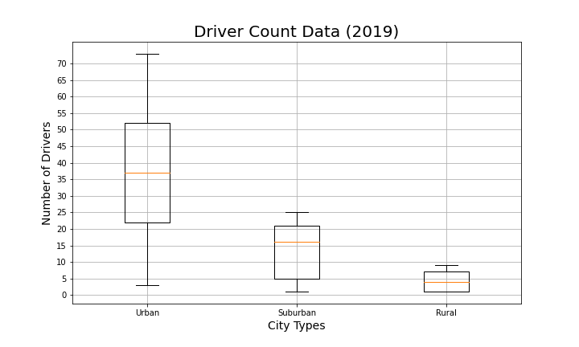
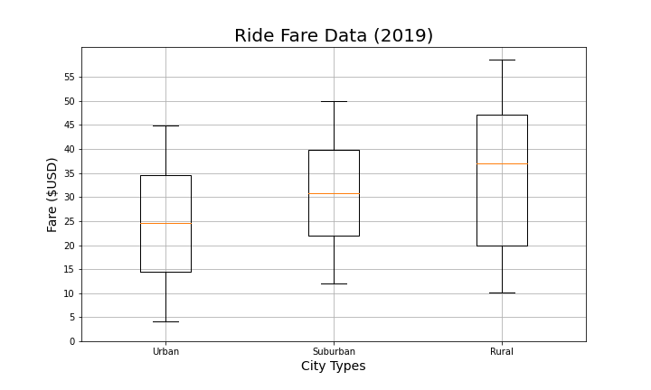
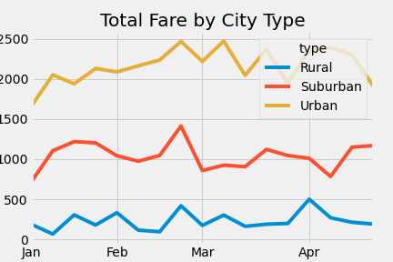

# PyBer_Analysis

## Overview
To perform analysis of ride-sharing data by city type.  
## Results
 There is a expected coorilation to the number of rides to the size of the city as one would expect (Urban cities tend to have the most rides with reduced rides for suburban, and even fewer in rural cities.
 
 
 
 There is also a corrilation between the share of drivers to size a the cities.
 
  
 
 Since there are fewer driver per ride in the suburban and rural cities then in urban cities this causes the higher average fare in these cities which causes an outsize share of the whole.
 
 
 

## Summary
  Business recommendations vary based the overall strategy the company is trying to pursue.  If the company is looking to expand profit margins they could reduce driver count in urban cities this would cause increased demand for the remaining drivers causing the average fare price to rise as the data shows that riders are willing to pay higher prices as seen in suburban and rural areas.  If the company is trying to expand or take market share the compnay could look to add drivers especially if they were trying to expand in rural areas.  It would also be usful to know distance of each ride and current profit per ride.  This would be useful as trips in the rural cities might tend to be longer which is why the fare would be higher, whereas those in the urban cities could tend to be shorter which is the reason for the lower fares.

 
 
